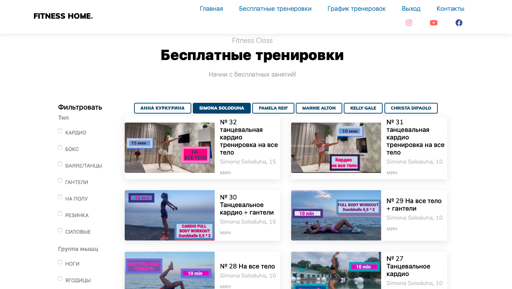

### [Личный сайт с рекомендациями домашних тренировок](https://fitness212121.herokuapp.com ) 

Для доступа к сайту пользователю необходимо авторизоваться. Так же пользователю доступно:

1. Регистрация 
2. Авторизация (по login/email и паролю)
3. Восстановление пароля (с подтверждением кода через email)

Смотреть демо-видео:

### Авторизированным пользователям доступны следующие возможности

- Возможности выбирать (фильтровать) список рекомендуемых видео по:

1. Тренеру
2. Длительности
3. Группе мышц
4. Типу тренировок

Смотреть демо-видео:

- Возможность смотреть графики тренировок для разных целей и нагрузки 
- Подписка на новости и акции (в разработке)
- Платная подписка на новые видео и новые графики тренировок (в разработке)
- Мультиязычность (в разработке)

Stack: Python, Django, HTML5, CSS, JavaScript, Bootstrap, celery, sqlite3, PostgreSQL, heroku

Cсылка на heroku: https://fitness212121.herokuapp.com 

